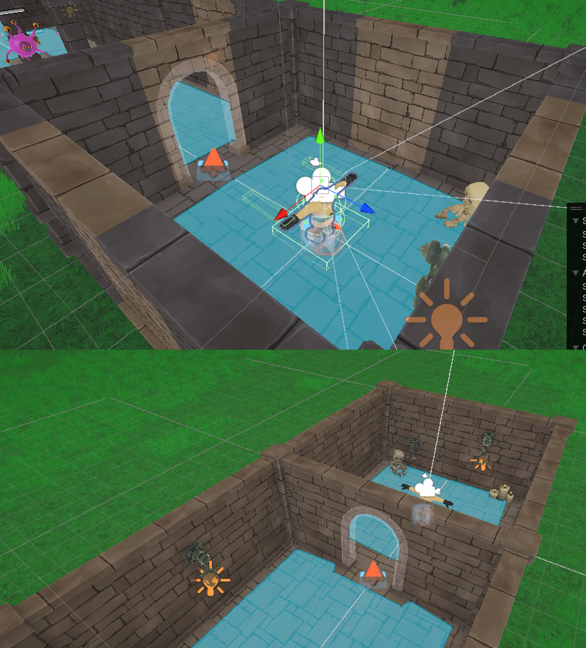

# Proyecto Unity - Trabajo Práctico

Este proyecto es parte de un trabajo práctico que tiene como objetivo integrar distintos conceptos de desarrollo en Unity, tales como iluminación, animaciones, optimización con LOD y perspectiva en primera persona.

---

## Requisitos del trabajo

**Escena 1 (Exterior)**
1. ⏳ Iluminación baked y luces de tipo mixed y/o real time según el criterio para cada caso.
2. ✅ Punto de vista en Primera Persona.
3. ✅ Modificar objetos o agregar con LOD.
4. ⏳ Incluir animación de objetos en loop. (Opcional: cambiar de animación según alguna interacción)

**Escena 2 (Dungeon)**
1. ✅ Iluminación baked y luces de tipo mixed y/o real time según el criterio para cada caso.
2. ✅ Punto de vista en Primera Persona.
3. ✅ Modificar objetos o agregar con LOD.
4. ✅ Incluir animación de objetos en loop. 

---
---

## Progreso

## ✔️ [04/06/2025] Shader Graph personalizado para paredes de la dungeon
Se diseñó un shader personalizado con Shader Graph para aplicar materiales estilizados a las paredes de la escena del calabozo (Dungeon).

🔧 Implementación técnica:

Se creó una propiedad expuesta de textura (_BaseMap) para permitir la asignación dinámica desde el material.

Se conectó esta textura al nodo Base Color del Fragment, asegurando compatibilidad con materiales URP estándar.

Se agregó una propiedad de color para Emission, que permite controlar el brillo que emite el material. Este valor se multiplica por la textura para generar un efecto de autoiluminación sutil.

Se utilizó un material con este shader personalizado (DungeonWallMat) para reemplazar los materiales anteriores en los MeshRenderer de las paredes.

🎨 Resultado:
Las paredes ahora cuentan con un shader visualmente más rico, con control directo sobre la textura y el brillo (emisión), permitiendo más flexibilidad artística y una mejor integración con la ambientación de la escena.

🖼️ [GIF o imagen del resultado próximamente]

### ✔️  [03/06/2025] Integración de Reflection Probe y Light Probe (Escena Dungeon)

Se agregaron Reflection Probes y Light Probes en la Escena 2 para optimizar los reflejos y la iluminación indirecta de los objetos dinámicos en el calabozo.

Reflection Probes:

Colocados en áreas clave para capturar los reflejos de las habitaciones y los pasillos.

Configuración optimizada en modo Baked para reducir el impacto en el rendimiento.

Light Probes:

Distribuidos en zonas estratégicas: alrededor de fuentes de luz (antorchas, lámparas) y en transiciones de luz/sombra (esquinas, pasillos estrechos).

### ✔️ [02/06/2025] Corrección de iluminación baked en paredes
Se detectó que algunas paredes interiores se veían notablemente más claras debido a una configuración incorrecta de Light Probes y la ausencia de mapas horneados asignados.Add commentMore actions

🔧 Correcciones aplicadas:

Se desactivó el uso de Light Probes en las paredes estáticas.

Se marcó correctamente cada pared como Static y con Contribute Global Illumination.

Se forzó un rebake desde la ventana de Lighting → Scene, usando la opción Generate Lighting.

Se verificó que todos los objetos estáticos estén correctamente asignados al Baked Lightmap correspondiente.

Esto permitió una integración coherente de la iluminación en todo el entorno horneado, eliminando discrepancias visuales entre paredes contiguas.

--

### ✔️ [30/05/2025] Ajuste de materiales del castillo

Se aplicó un **material con Shader doble cara (Render Face: Both)** en paredes con caras invertidas, evitando problemas de visualización al mirarlas desde el interior.

---

### ✔️ [24/05/2025] Ajustes de Iluminación y Light Probes (Escena Exterior)

Se asignó correctamente la fuente de luz direccional (Sun Source) en la configuración de iluminación global.  
Además, se están comenzando a aplicar **Light Probes** para capturar la iluminación indirecta y aplicarla a objetos móviles, permitiendo que se integren visualmente mejor con el entorno horneado.

---

### ✔️ [23/04/2025] Animaciones de enemigos en loop e interacciones

Los enemigos del juego cuentan con animaciones de **idle** y **desplazamiento en loop**, y animaciones de **ataque** que se disparan según la lógica del juego.  
> Estas animaciones se manejan mediante el componente `EnemyAnimation.cs`, que encapsula el control del `Animator`.

**Preview (GIF próximamente):**  

---

### ✔️ [22/04/2025] Implementación de cámara en primera persona

Se implementó un controlador de jugador con perspectiva en primera persona, usando una cámara adherida al cuerpo del personaje que rota con el mouse horizontalmente y verticalmente dentro de un rango limitado.  
Además, se evitó que la cámara se posicione detrás del jugador o atraviese el cuerpo del mismo.

> 🛠️ La lógica se implementó directamente en el script `PlayerController.cs` usando componentes como `CharacterController` y un `cameraPivot`.

---

## 📌 Pendientes

- Ambientación final de la escena exterior.
- Distribución y bake final de Light Probes en escena exterior.
- Verificar iluminación en todos los sectores de la escena desde el punto de vista del jugador.
- Implementar cambio de animación por interacción en kla escena del exterior.
- Revisión de rendimiento final con LODs aplicados.

---

## 🐱‍👓 Extras

- Centrar el mouse/puntero a la pantalla con el jugador mirando al frente.

---

## 💫Estadísticas 

Trabajo semanal en proyecto:

