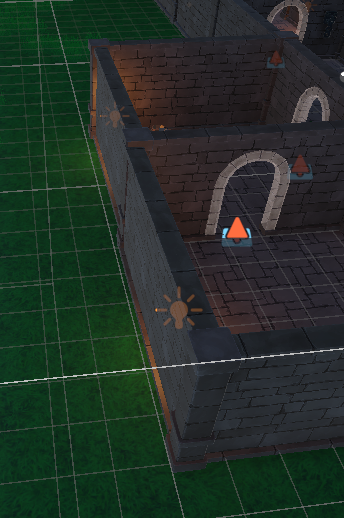
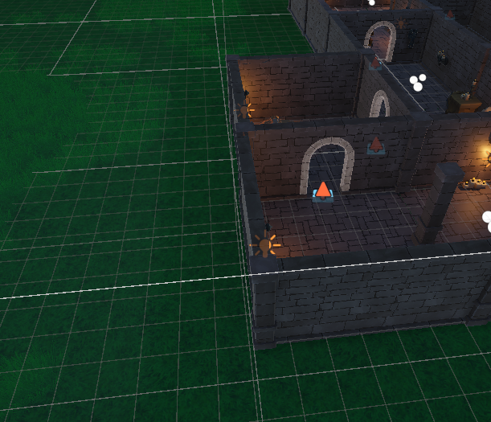
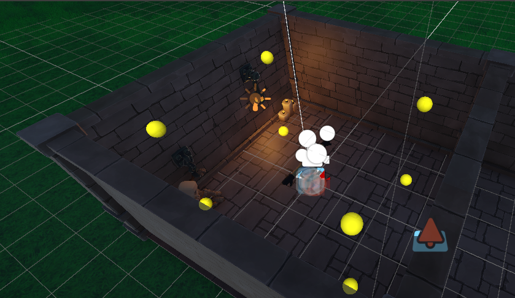

# Proyecto Unity - Trabajo Práctico

Este proyecto es parte de un trabajo práctico que tiene como objetivo integrar distintos conceptos de desarrollo en Unity, tales como iluminación, animaciones, optimización con LOD y perspectiva en primera persona.

---

## Requisitos del trabajo

**Escena 1 (Dungeon)**
1. ✅ Iluminación baked y luces de tipo mixed y/o real time según el criterio para cada caso.
2. ✅ Punto de vista en Primera Persona.
3. ✅ Modificar objetos o agregar con LOD.
4. ✅ Incluir animación de objetos en loop. 
5. ✅ Agregado de materiales con  Shader Graph

**Nueva escena (Exterior)**
1. ⏳ Iluminación baked y luces de tipo mixed y/o real time según el criterio para cada caso.
2. ✅ Punto de vista en Primera Persona.
3. ✅ Modificar objetos o agregar con LOD.
4. ⏳ Incluir animación de objetos en loop. (Opcional: cambiar de animación según alguna interacción)
5. ⏳ Agregado de materiales con  Shader Graph

---
---

## Progreso

## ✔️ [04/06/2025] Shader Graph personalizado para paredes de la dungeon & Configuración de iluminación optimizada

### Shader Graph personalizado para paredes
- Se diseñó un shader personalizado con **Shader Graph** para aplicar materiales estilizados a las paredes de la escena del calabozo (**Dungeon**).
- Se creó una propiedad expuesta de textura (**_BaseMap**) para permitir la asignación dinámica desde el material.
- Se conectó esta textura al nodo **Base Color** del Fragment, asegurando compatibilidad con materiales **URP estándar**.
- Se agregó una propiedad de color para **Emission**, que permite controlar el brillo que emite el material.
- Se utilizó un material con este shader personalizado (**DungeonWallMat**) para reemplazar los materiales anteriores en los **MeshRenderer** de las paredes.

### Configuración de iluminación con Light Probes y sombras para Point Lights
- Se implementó una configuración de iluminación optimizada en la escena:
  - Colocación de **Light Probes** estratégicamente para mejorar la iluminación indirecta en áreas con luces dinámicas.
  - Configuración de **Point Lights** con sombras **Hard Shadows** para evitar que la luz atraviese paredes y mejorar el realismo en la iluminación.
  - Ajuste de los rangos de luz y las máscaras de culling para optimizar el rendimiento y asegurar que las luces afecten solo las áreas necesarias.

### 🔧 Implementación:
1. **Shader Graph**:
   - Propiedad expuesta de textura (**_BaseMap**) conectada al **Base Color**.
   - Emisión de luz controlada por la propiedad de color **Emission**.
   - Aplicación del material personalizado a las paredes.
2. **Iluminación**:
   - Ubicación estratégica de **Light Probes** en zonas clave (transiciones de luz/sombra, esquinas).
   - Activación de **Hard Shadows** en luces dinámicas.

Luces antes:

Luces después:

## Oscilación de brillo con Shader Graph (efecto de pulso sobre textura de enemigo)
Se implementó un sistema dentro del Shader Graph para permitir que la textura del material varíe dinámicamente su brillo con el tiempo, generando un efecto visual tipo pulso. 

🔧 Implementación:
Textura Base

Se expuso la propiedad _BaseMap en el Shader para poder asignar la textura desde el material.

Se utilizó un nodo Sample Texture 2D para obtener el color de la textura.

Oscilación del brillo con tiempo

Se tomó el valor de tiempo (Time) y se lo modificó con un nodo Sine para obtener un valor oscilante entre -1 y 1.

Este valor se transformó con un nodo Remap para mapearlo al rango 0.5 - 1.5 (brillo más oscuro y más claro).

Finalmente, se usó un nodo Multiply para multiplicar el color de la textura por este valor oscilante, generando el efecto de pulso.

Salida del shader

<!-- puedes reemplazar esta línea con el path real si decides capturar pantalla -->

### ✔️  [03/06/2025] Integración de Reflection Probe y Light Probe (Escena Dungeon)

Se agregaron Reflection Probes y Light Probes en la Escena 2 para optimizar los reflejos y la iluminación indirecta de los objetos dinámicos en el calabozo.

Reflection Probes:

Colocados en áreas clave para capturar los reflejos de las habitaciones y los pasillos.

Configuración optimizada en modo Baked para reducir el impacto en el rendimiento.

Light Probes:

Distribuidos en zonas estratégicas: alrededor de fuentes de luz (antorchas, lámparas) y en transiciones de luz/sombra (esquinas, pasillos estrechos).

---

### ✔️ [02/06/2025] Corrección de iluminación baked en paredes
Se detectó que algunas paredes interiores se veían notablemente más claras debido a una configuración incorrecta de Light Probes y la ausencia de mapas horneados asignados.Add commentMore actions

🔧 Correcciones aplicadas:

Se desactivó el uso de Light Probes en las paredes estáticas.

Se marcó correctamente cada pared como Static y con Contribute Global Illumination.

Se forzó un rebake desde la ventana de Lighting → Scene, usando la opción Generate Lighting.

Se verificó que todos los objetos estáticos estén correctamente asignados al Baked Lightmap correspondiente.

Esto permitió una integración coherente de la iluminación en todo el entorno horneado, eliminando discrepancias visuales entre paredes contiguas.

--

### ✔️ [30/05/2025] Ajuste de materiales del castillo

Se aplicó un **material con Shader doble cara (Render Face: Both)** en paredes con caras invertidas, evitando problemas de visualización al mirarlas desde el interior.

---

### ✔️ [24/05/2025] Ajustes de Iluminación y Light Probes (Escena Exterior)

Se asignó correctamente la fuente de luz direccional (Sun Source) en la configuración de iluminación global.  
Además, se están comenzando a aplicar **Light Probes** para capturar la iluminación indirecta y aplicarla a objetos móviles, permitiendo que se integren visualmente mejor con el entorno horneado.

---

### ✔️ [23/04/2025] Animaciones de enemigos en loop e interacciones

Los enemigos del juego cuentan con animaciones de **idle** y **desplazamiento en loop**, y animaciones de **ataque** que se disparan según la lógica del juego.  
> Estas animaciones se manejan mediante el componente `EnemyAnimation.cs`, que encapsula el control del `Animator`.

**Preview (GIF próximamente):**  

---

### ✔️ [22/04/2025] Implementación de cámara en primera persona

Se implementó un controlador de jugador con perspectiva en primera persona, usando una cámara adherida al cuerpo del personaje que rota con el mouse horizontalmente y verticalmente dentro de un rango limitado.  
Además, se evitó que la cámara se posicione detrás del jugador o atraviese el cuerpo del mismo.

> 🛠️ La lógica se implementó directamente en el script `PlayerController.cs` usando componentes como `CharacterController` y un `cameraPivot`.

---

## 📌 Pendientes

- Ambientación final de la escena exterior.
- Distribución y bake final de Light Probes en escena exterior.
- Verificar iluminación en todos los sectores de la escena desde el punto de vista del jugador.
- Implementar cambio de animación por interacción en kla escena del exterior.

---
---

## 💫Estadísticas 

